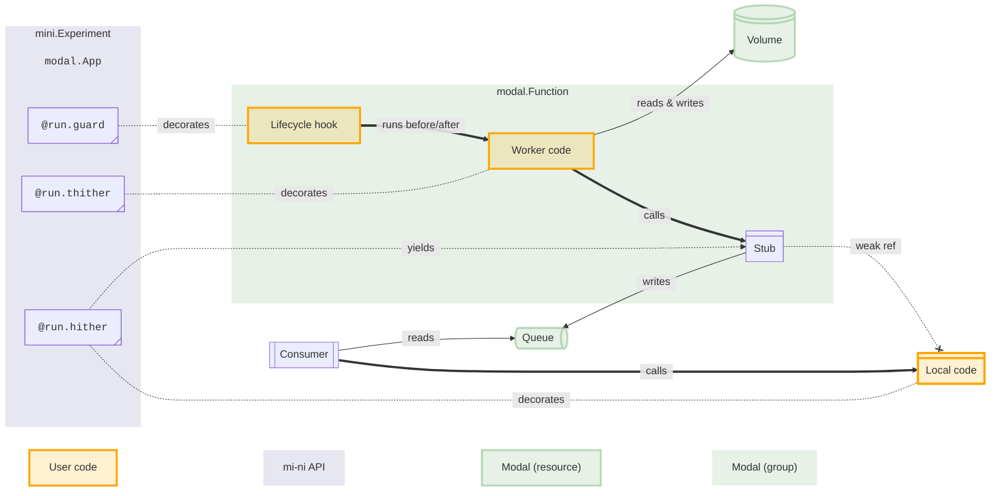

## Architecture Overview

mi-ni creates a bidirectional flow between local and remote environments. With `@run.hither`, you define functions that always run locally but can be called from remote code. With `@run.thither`, you define functions that always run remotely (with access to GPUs and other cloud resources) but integrate with your local notebook.



The diagram above shows how Modal's queues and volumes provide the communication backbone, while mi-ni's decorators manage the execution context. The orange components represent your code, while the green elements are Modal's infrastructure. The blue sections are mi-ni's API layer that bridges these worlds.

## Run hither

This function _always_ runs locally:

```python
@run.hither
async def track(loss: float):
    record(loss)
```

The `@run.hither` decorator transforms a function into a stub. Or more accurately: a context manager that yields a stub.

The stub has one job: when you call it, it puts the parameters onto a (distributed) [modal.Queue](https://modal.com/docs/reference/modal.Queue). Locally, mi-ni runs an event loop that dispatches those calls to your function. The stub doesn't wait for the actual function to complete, and it doesn't return anything (the real function's return value is ignored).

_Run-hither_ supports several types of callback:
- Bare callbacks (as above)
- Factory functions that return stateful callbacks.
- Context managers that yield stateful callbacks, and which can clean up resources at the end of the run.

In all cases, `@run.hither` ensures the function is wrapped in a context manager. The yielded stub function doesn't contain any references to your actual function, so it's fine to pickle it and use it in the remote functions. This happens transparently when you use it in an `async with` block.


## Run thither

This function always runs remotely:

```python
@run.thither(gpu='L4')
async def train(epochs: int, track):
    for _ in range(epochs):
        track(some_training_function())
    print('Training complete')
```

The `@run.thither` decorator provides similar functionality to [modal.App.function](https://modal.com/docs/reference/modal.App#function) — but Unlike Modal's decorator, it _always_ runs remotely. It runs some extra lifecycle hooks, and handles `stdout` streaming.

In this example, `track` is a callback — it's the _run-hither_ stub defined further up.

_Run-thither_ functions can return a value that you can assign locally. Alternatively, you can write them as generators (by using `yield`).


## With context

This code coordinates remote and local execution:

```python
async with run(), track as callback:
    await train(25, callback)
```

Let's break it down:
- `async with run()`: This is like [modal.App.run](https://modal.com/docs/reference/modal.App#run). It starts a session for your app, and runs the loop that streams `stdout` from your remote functions.
- `track as callback`: At this point (locally), `track` is a context manager. This line enters the context manager, the result of which is the _run-hither_ stub function. Until the context manager exits, it consumes from a distributed queue to make local calls to the original `track` function.
- `await train(25, callback)`: This calls the remote `train` function. The stub `track` callback is passed in as a parameter — it gets serialized and sent to the remote function, which gives the remote function indirect access to the distributed queue.
