## Architecture Overview

mi-ni creates a bidirectional flow between local and remote environments. With `@run.hither`, you define functions that always run locally but can be called from remote code. With `@run.thither`, you define functions that always run remotely (with access to GPUs and other cloud resources) but integrate with your local notebook.

```mermaid
graph LR

    classDef user stroke:orange,fill:#fb23,stroke-width:3px;
    classDef modal stroke:#8b88,fill:#8b83,stroke-width:3px;
    classDef modalbox stroke:#8b8,stroke-width:3px,fill:none;
    classDef minibox stroke:#88b,stroke-width:3px,fill:none;

    E@{ shape: rect, label: "run = Experiment()" }

    guard_cb:::user@{ shape: rect, label: "@run.guard<br>Lifecycle hook" }
    loc:::user@{ shape: rect, label: "@run.hither<br>Local callback" }
    rem:::user@{ shape: rect, label: "@run.thither<br>Remote function" }

    subgraph modal [Modal]
        A:::modal@{ shape: rect, label: "App" }
        F:::modal@{ shape: rect, label: "Function" }
        V:::modal@{ shape: disk, label: " Volume " }
    end
    modal:::modalbox

    rem ==>|"&nbsp; calls &nbsp;"| loc

    E --->|"&nbsp; manages &nbsp;"| A
    rem -->|"&nbsp; reads & writes &nbsp;"| V
    rem -->|"&nbsp; runs in &nbsp;"| F

    guard_cb ==>|"&nbsp; runs before/after &nbsp;"| rem
```





<details><summary>&nbsp;📐 How it works</summary>



```mermaid
graph LR
    V:::modal@{ shape: disk, label: " Volume " }
    Q:::modal@{ shape: das, label: " Queue " }

    classDef user stroke:orange,fill:#fb23,stroke-width:3px;
    classDef modal stroke:#8b88,fill:#8b83,stroke-width:3px;
    classDef modalbox stroke:#8b8,stroke-width:3px,fill:none;
    classDef minibox stroke:none,fill:none;

    subgraph EG [ ]
        app@{ shape: rect, label: "run = Experiment()"}
        guards@{ shape: tag-rect, label: "@run.guard"}
        thither@{ shape: tag-rect, label: "@run.thither"}
        hither@{ shape: tag-rect, label: "@run.hither"}
    end
    EG:::minibox

    cons@{ shape: subproc, label: "Consumer" }

    subgraph Fn [modal.Function]
        guard_cb:::user@{ shape: rect, label: " Lifecycle hook " }
        rem:::user@{ shape: rect, label: " Worker code " }
        stubs@{ shape: div-rect, label: " Stub " }
    end
    Fn:::modalbox

    loc:::user@{ shape: div-rect, label: " Local code " }

    rem -->|"&nbsp; reads & writes &nbsp;"| V

    guards -.-|"&nbsp; decorates &nbsp;"| guard_cb
    guard_cb ==>|"&nbsp; runs before/after &nbsp;"| rem
    thither -.-|"&nbsp; decorates &nbsp;"| rem
    rem ==>|"&nbsp; calls &nbsp;"| stubs
    stubs -->|"&nbsp; writes &nbsp;"| Q
    stubs -.-x|"&nbsp; weak ref &nbsp;"| loc

    hither -.->|"&nbsp; yields &nbsp;"| stubs
    hither -.-|"&nbsp; decorates &nbsp;"| loc

    cons -->|"&nbsp; reads &nbsp;"| Q
    cons ==>|"&nbsp; calls &nbsp;"| loc

    Q ~~~ stubs

    _mini@{ shape: rect, label: "mi-ni API" }
    _modal:::modal@{ shape: rect, label: "Modal" }
    _user:::user@{ shape: rect, label: "User code" }
    _user ~~~ _mini ~~~ _modal
```

The diagram above shows how Modal's queues and volumes provide the communication backbone, while mi-ni's decorators manage the execution context. The orange components represent your code, while the green elements are Modal's infrastructure. The blue sections are mi-ni's API layer that bridges these worlds.

</details>

## Run hither

This function _always_ runs locally:

```python
@run.hither
async def track(loss: float):
    display(loss)
```

The `@run.hither` decorator transforms a function into a stub. Or more accurately: a context manager that yields a stub when used in a `with` statement:

```python
async with run(), track as t:
    remote_fn(t)
```

The stub has one job: when you call it, it puts the parameters onto a (distributed) [modal.Queue](https://modal.com/docs/reference/modal.Queue). Locally, mi-ni runs an event loop that dispatches those calls to your function. The stub doesn't wait for the actual function to complete, and it doesn't return anything (the real function's return value is ignored).

```mermaid
graph LR
    hither:::minibox
    subgraph hither ["@run.hither"]
        fn:::user@{ shape: rect, label: "Callback<br>async def track(loss):"}
    end
    stub@{ shape: div-rect, label: "Stub<br>def t(loss):"}

    fn ~~~ stub

    hither ---|"&nbsp; yields on enter &nbsp;"| stub
    stub -.-|"&nbsp; calls indirectly &nbsp;"| fn

    classDef user stroke:orange,fill:#fb23,stroke-width:3px;
    classDef minibox stroke:#88b3,stroke-width:3px,fill:transparent;
```



_Run-hither_ supports several types of callback:
- Bare callbacks (as above)
- Factory functions that return stateful callbacks.
- Context managers that yield stateful callbacks, and which can clean up resources at the end of the run.

In all cases, `@run.hither` ensures the function is wrapped in a context manager. The yielded stub function doesn't contain any references to your actual function, so it's fine to pickle it and use it in the remote functions. This happens transparently when you use it in an `async with` block.

### Stateful callbacks

This function _returns_ a callback that runs locally:

```python
@run.hither
def tracker(opts):
    state = []

    async def track(loss):
        clear_display(wait=True)
        state.append(loss)
        plot(state)

    return track
```

By wrapping your callback in a factory function, you can prepare some state that it will have access to. In this example, the factory creates a list to store metrics, to progressively draw a chart.

Like the basic callback pattern above, the `@run.hither` decorator wraps the factory in a context manager. When it's used in a `with` statement, it calls the factory and then transforms the returned callback into a stub. Unlike the basic form, however, you should _call_ the wrapped factory function in the `with` statement. This gives you the opportunity to pass in options.

```python
async with run(), track(opts) as t:
    remote_fn(t)
```




```mermaid
graph LR
    hither:::minibox
    subgraph hither ["@run.hither"]
        fac:::user@{ shape: rect, label: "Factory<br>def tracker(opts):"}
        fn:::user@{ shape: rect, label: "Callback<br>async def track(loss):"}
        state:::user@{ shape: doc, label: "State"}
    end
    stub@{ shape: div-rect, label: "Stub<br>def t(loss):"}

    fac ---|"&nbsp; creates &nbsp;"| fn
    fac ~~~ stub
    fac ---|"&nbsp; creates &nbsp;"| state

    hither ---|"&nbsp; yields on enter &nbsp;"| stub
    stub -.-|"&nbsp; calls indirectly &nbsp;"| fn

    classDef user stroke:orange,fill:#fb23,stroke-width:3px;
    classDef minibox stroke:#88b3,stroke-width:3px,fill:transparent;
```

### Stateful callbacks with cleanup

This function _yields_ a callback that runs locally:

```python
@run.hither
@asynccontextmanager
async def progressbar(epochs):

    with tqdm(total=epochs) as pbar:
        async def step(n=1):
            pbar.update(n)

        yield step
```

Or equivalently:

```python
@run.hither
@asynccontextmanager
async def progressbar(epochs):

    async def step(n=1):
        pbar.update(n)

    pbar = tqdm(total=epochs)
    try:
        yield step
    finally:
        pbar.close()
```

Use it the same way as the factory type:

```python
async with run(), progressbar(25) as step:
    train_remote(25, step)
```

Like the factory type, your wrapper function can create some state that the callback can use and modify. But because the wrapper is explicitly decorated with `@asynccontextmanager`, your code has the opportunity to clean up resources when the remote code has finished.

```mermaid
graph LR
    hither:::minibox
    ctx:::minibox
    subgraph hither ["@run.hither"]
        subgraph ctx ["@asynccontextmanager"]
            fac:::user@{ shape: rect, label: "Factory<br>async def progressbar(epochs):"}
            fn:::user@{ shape: rect, label: "Callback<br>async def step(n):"}
            state:::user@{ shape: doc, label: "tqdm"}
        end
    end
    stub@{ shape: div-rect, label: "Stub<br>def step(n):"}

    fac ---|"&nbsp; creates &nbsp;"| fn
    fac ~~~ stub
    fac ---|"&nbsp; creates &nbsp;"| state
    fac ---|"&nbsp; closes &nbsp;"| state

    hither ---|"&nbsp; yields on enter &nbsp;"| stub
    stub -.-|"&nbsp; calls indirectly &nbsp;"| fn

    classDef user stroke:orange,fill:#fb23,stroke-width:3px;
    classDef minibox stroke:#88b3,stroke-width:3px,fill:transparent;
```





## Run thither

This function always runs remotely:

```python
@run.thither(gpu='L4')
async def train(epochs: int, track):
    for _ in range(epochs):
        track(some_training_function())
    print('Training complete')
```

The `@run.thither` decorator provides similar functionality to [modal.App.function](https://modal.com/docs/reference/modal.App#function) — but Unlike Modal's decorator, it _always_ runs remotely. It runs some extra lifecycle hooks, and handles `stdout` streaming.

In this example, `track` is a callback — it's the _run-hither_ stub defined further up.

_Run-thither_ functions can return a value that you can assign locally. Alternatively, you can write them as generators (by using `yield`).


## With context

This code coordinates remote and local execution:

```python
async with run(), track as callback:
    await train(25, callback)
```

Let's break it down:
- `async with run()`: This is like [modal.App.run](https://modal.com/docs/reference/modal.App#run). It starts a session for your app, and runs the loop that streams `stdout` from your remote functions.
- `track as callback`: At this point (locally), `track` is a context manager. This line enters the context manager, the result of which is the _run-hither_ stub function. Until the context manager exits, it consumes from a distributed queue to make local calls to the original `track` function.
- `await train(25, callback)`: This calls the remote `train` function. The stub `track` callback is passed in as a parameter — it gets serialized and sent to the remote function, which gives the remote function indirect access to the distributed queue.
